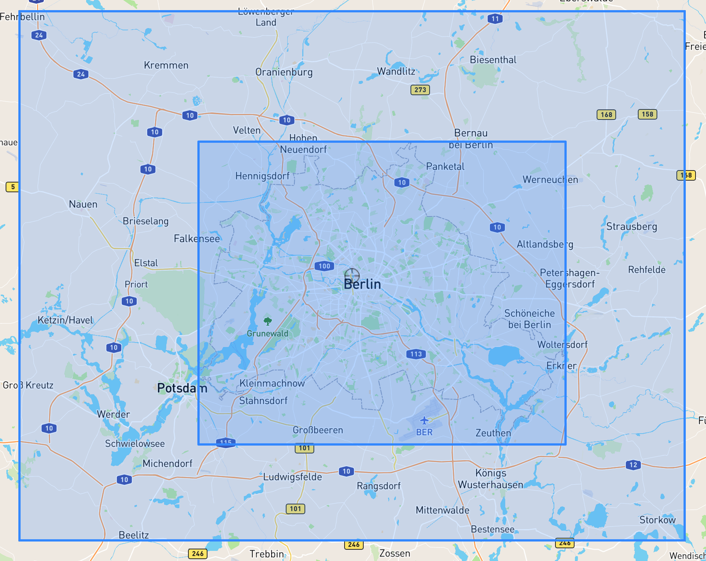
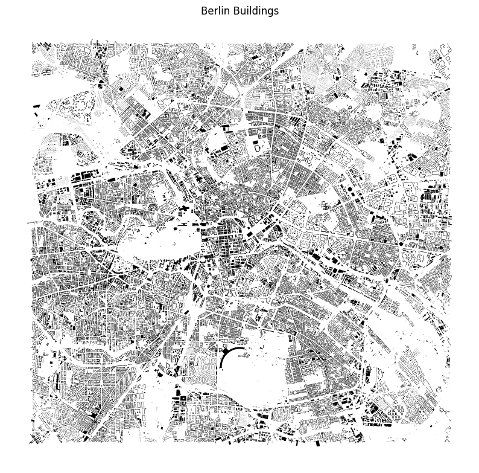
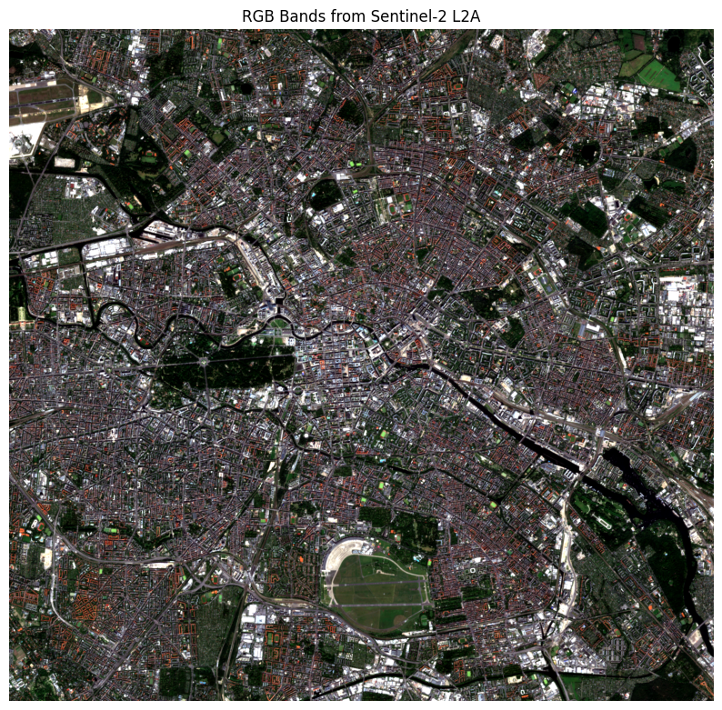
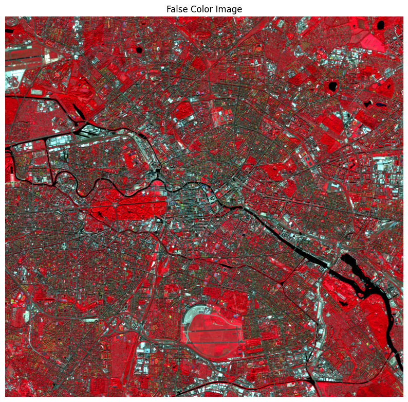
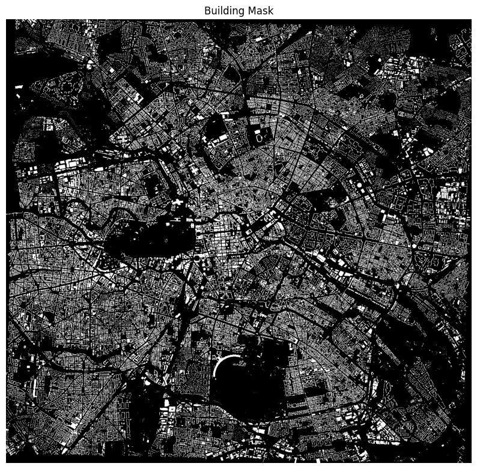
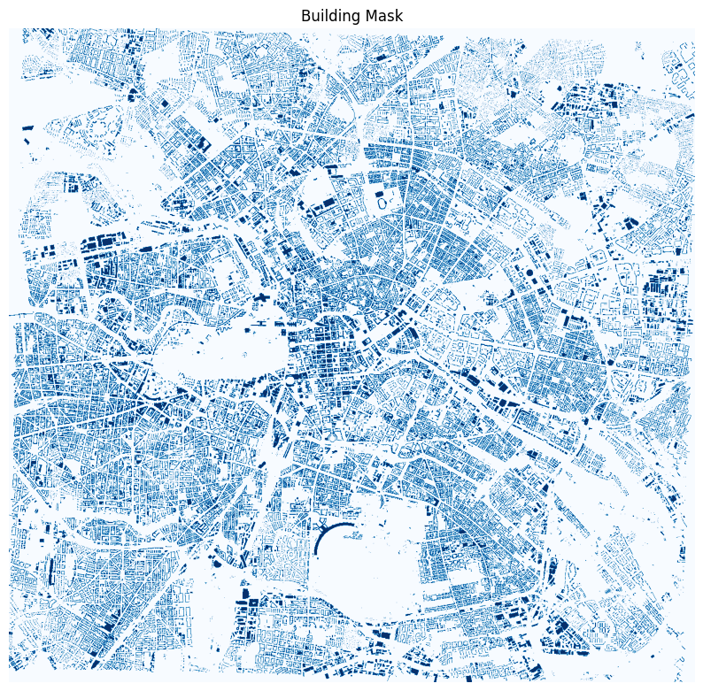
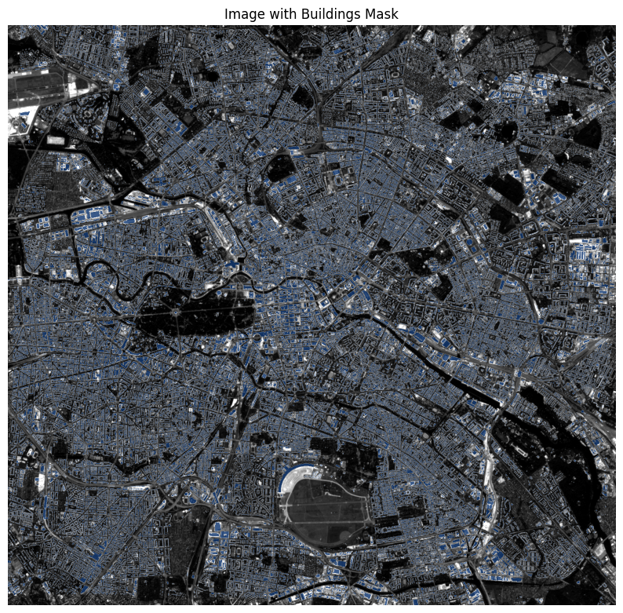

# Setup
- We assume a Debian/Ubuntu Distribution to run the code on
```
python3 -m venv .venv
source .venv/bin/activate
pip install -r requirements.txt

```


#  Links for Satellite Images


Good for looking at bounding boxes:

http://bboxfinder.com

---
(52.230095,12.760088,52.819950,13.979952)



Because the initial Bounding box is far wider than the actual city bounds, we need to reduce the bounds to the actual city


## Images

#### Buildings



#### RGB Bands Sentinel-2 L2A


#### False Color Image


#### Buildings Mask



and in blue



Greyscale IMG with buildings mask

